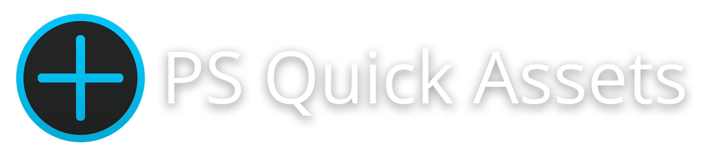

<h1 align="center">
    
</h1>

    

 

    ## Simple app to quickly add images as new layer to Photoshop document  
    
    ## No more searching for files - just click on image and you're done!
    

 

- Supported image files: `.jpg, .png .bmp .tiff, .psd .psb`
- You can add multiple folders 
- Open app window with shortcut or by clicking on tray icon
- Default shortcut is  `Ctrl + Alt + F8`,  and can be changed to whatever you like

 

## Feel free to let me know if you found a bug, or have a suggestion!
